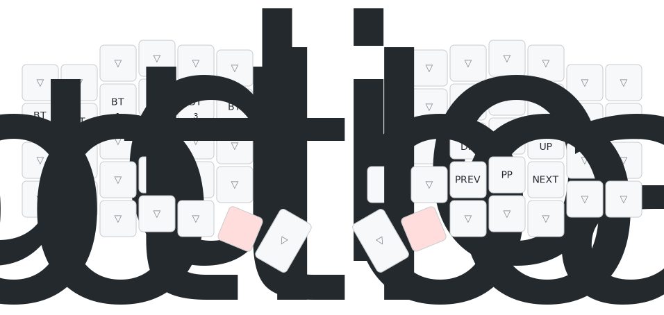

# ZMK Config for Sofle Keyboard

This is a ZMK firmware configuration for the Sofle split keyboard, based on the QMK keymap from qmk-userspace.

## Features

- 4 layers: QWERTY, LOWER, RAISE, and ADJUST
- Conditional layer (LOWER + RAISE = ADJUST)
- Encoder support for volume and page scrolling
- OLED display with battery percentage
- ZMK Studio support for real-time keymap editing
- Optimized for macOS usage

## Layers

### QWERTY (Base Layer)
Standard QWERTY layout with ESC, TAB, and modifier keys in expected positions.

### LOWER (Layer 1)
- Function keys (F1-F12)
- Number row
- Symbols and special characters

### RAISE (Layer 2)
- Navigation keys (arrows, page up/down, home/end)
- Text editing shortcuts (copy, paste, cut, undo)
- Word navigation (Ctrl+Left/Right)

### ADJUST (Layer 3)
System controls:
- Bluetooth profile management
- Media controls (volume, play/pause, next/prev)
- Bootloader access
- ZMK Studio unlock

## Building

1. Fork this repository
2. Enable GitHub Actions in your fork
3. Push changes to trigger automatic builds
4. Download firmware artifacts from the Actions tab

## Flashing

1. Download the firmware files from GitHub Actions artifacts
2. Put the keyboard into bootloader mode (use ADJUST layer bootloader key or physical reset)
3. Flash the appropriate .uf2 file to each half:
   - `sofle_left-nice_nano_v2-zmk.uf2` for the left half
   - `sofle_right-nice_nano_v2-zmk.uf2` for the right half

## Configuration

- Display is enabled by default
- Deep sleep set to 30 minutes
- Bluetooth transmit power increased for better range
- Eager debouncing for responsive typing

## Hardware

Configured for Nice!Nano v2 controllers. If using different controllers, update the `build.yaml` file accordingly.